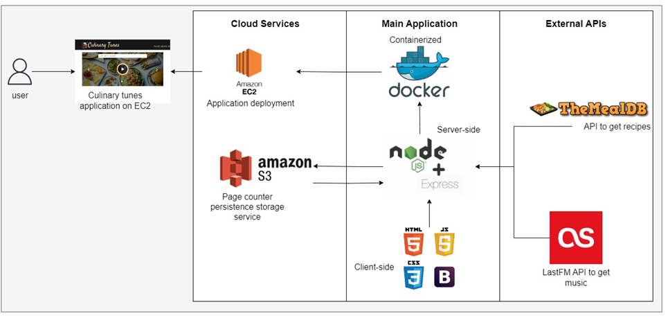

# Culinary Tunes
Node app that provides recipe recommendations and music recommendations corresponding to the cuisine.

### Getting Started

1. Navigate to the `app` directory and run
```
npm install
```

2. To start the app in debugger mode, run
```
npm start
```

This application was deployed on AWS EC2. The link to the docker image can be found here: https://hub.docker.com/repository/docker/asci25/culinary-tunes/

### Architecture

•	The arrows depict the direction of dataflow. 
All the code is hosted in a single directory called ‘app’. This folder contains the ‘server.js’ file which is responsible of all the routing as well as calling different services- the 2 APIs and S3 to fetch data.
•	The processed data is invoked by the client side which sits inside a folder named ‘public’ in the root app directory. The HTML, CSS and JS files are split to enhance readability and navigation. The javscript file handles all the responses from the server and arranges them to be compatible with the bootstrap elements to be displayed in the UI.
•	When a user interacts with the front end, the page view is first retrieved by calling the server-side API which requests the information from S3. The number of page views is then incremented and sent back to s3. 
•	When the user enters a dish/ingredient/country, the client-side makes a request to the server-side API for information. 
•	First, the Meal DB API is called to get recipes. This API returns a property called ‘strArea’ which provides information about the cuisine, which is then parsed and sent to the LastFM API to get music relevant to the tag.
•	The collective data from both the APIs is then parsed into a singular response. This response is then sent to the client-side.
•	The javascript in the client side then designs the data into layouts and cards to be displayed in the UI
•	The application is deployed in a docker container which is hosted in an EC2 instance created using standard guidelines. The application is accessed using the EC2 instance’s public subnet endpoint by invoking the right port.
